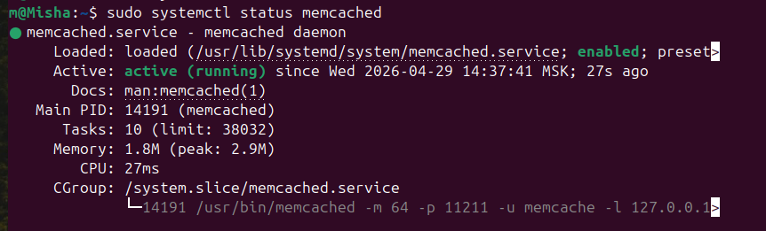
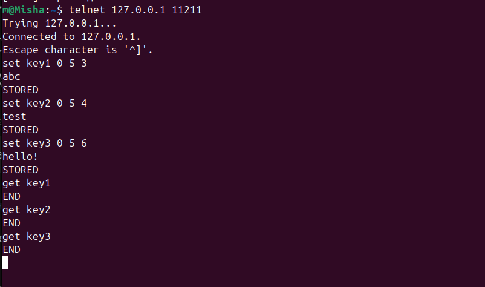
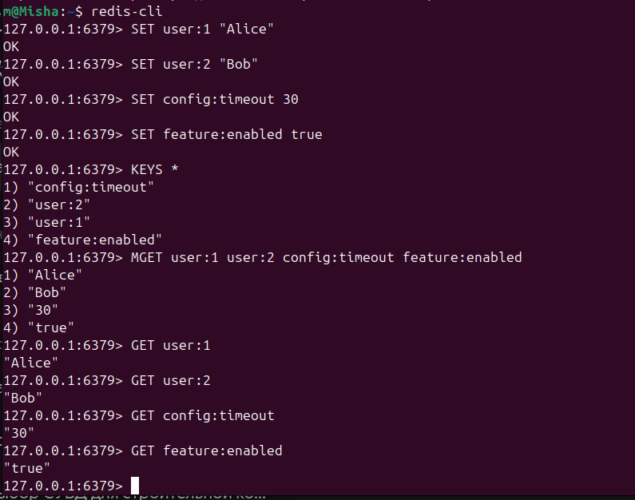

# Redis-memcached

# Домашнее задание к занятию «Кеширование Redis/memcached»

**Выполнил:** Чехлов Михаил

## Задание 1. Кеширование 

Кеширование помогает решить ряд проблем производительности и масштабируемости:

Высокая нагрузка на базу данных. Частые запросы к БД (особенно сложные SELECT) создают нагрузку. Кеш хранит результаты частых запросов, снижая число обращений к БД.

Медленный отклик приложения. Данные из кеша (в оперативной памяти) отдаются быстрее, чем из БД или при пересчёте. Улучшает UX.

Дорогостоящие вычисления. Если результат расчёта (агрегация, анализ) используется часто, его можно кешировать. Не нужно пересчитывать каждый раз.

Ограниченная пропускная способность внешних API. Кеширование ответов API снижает число запросов к сторонним сервисам (экономия денег, избежание лимитов).

Статические ресурсы. Изображения, CSS, JS-файлы кешируются браузером и CDN — не загружаются повторно. Ускоряет загрузку страниц.

Повторяющиеся сложные запросы. Результаты тяжёлых SQL-запросов (отчёты, дашборды) кешируются на время актуальности данных.

Снижение сетевого трафика. Локальный кеш (на сервере или клиенте) уменьшает объём передаваемых данных между компонентами системы.

Масштабирование. Кеш распределяет нагрузку, позволяя системе выдерживать больше пользователей без апгрейда железа.

## Задание 2. Memcached

*Все отображённые метрики имеют статус normal.*

## Задание 3. Удаление по TTL в Memcached

*Status - Enabled.*

## Задание 4. Запись данных в Redis

                 
*Zabbix server - available memory, cpu utilization.*
